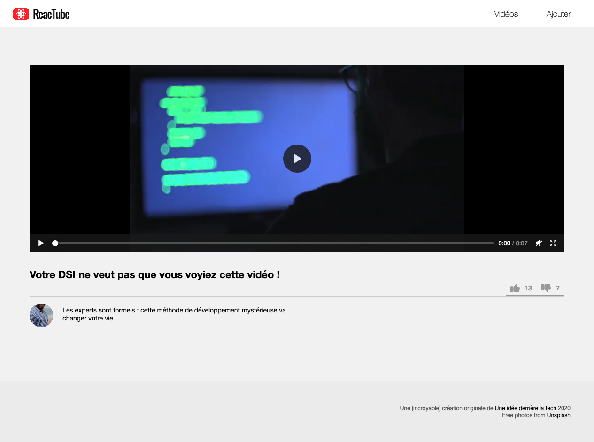

# A. Préparatifs <!-- omit in toc -->

## Sommaire <!-- omit in toc -->
- [A.1. Récupération du projet](#a1-récupération-du-projet)
- [A.2. Fast refresh](#a2-fast-refresh)


## A.1. Récupération du projet
Vous commencez maintenant à avoir l'habitude, je ne rentrerais donc pas dans les détails mais voici les différentes étapes pour le lancement du projet en mode [TL;DR](https://en.wiktionary.org/wiki/tl;dr)

1. **Créez un fork de ce TP sur https://framagit.org/cours-react/tp4/-/forks/new**

	- Choisissez de placer le fork **dans votre profil utilisateur** et vérifiez que le repo est **bien en mode "privé"**
	- **Ajoutez moi en tant que "reporter"**

2. **Tapez dans un terminal :**
	```bash
	mkdir ~/tps-react
	git clone https://framagit.org/<votre-username>/tp4.git ~/tps-react/tp4
	codium ~/tps-react/tp4
	```
3. **Puis dans 2 terminaux splittés de VSCodium :**
	```bash
	npx serve -l 8000
	```
	et
	```bash
	npm i
	npm run watch
	```

> _**NB :** si vous souhaitez plus de précisions sur les commandes précédentes et l'installation  / configuration du projet, vous pouvez vous référer au chapitre [A. Préparatifs](https://framagit.org/cours-react/tp2/-/blob/master/A-preparatifs.md) du TP2 ou simplement demander de l'aide au formateur_ 😄

Le résultat attendu est le suivant :



## A.2. Fast refresh
Actuellement quand vous modifiez votre code, la commande `npm run watch` relance la compilation automatiquement, puis vous rechargez manuellement la page dans votre navigateur pour voir les changements. C'est déjà bien mais **on peut mieux faire !**

Il existe depuis longtemps un système qui s'appelle le "live reload", qui permet de recharger automatiquement le navigateur dès qu'un fichier html, js, ou css est modifié. Mais dans l'écosystème React, il existe encore mieux : le **Fast Refresh**.

Le principe du Fast refresh, c'est que quand un composant de votre application est modifié, SEUL ce composant va être rechargé, sans avoir besoin de rafraîchir toute la page. Quels avantages ? Il y en a plein :
- **on ne recharge pas toute la page**, donc pas le html, ni les CSS, ni les images ça va donc **beaucoup plus vite**
- l'application **reste dans son état actuel** : notre navigateur reste là où il était dans la page (conservation du scroll, de la navigation, etc.)


Génial non ? Allons-y, mettons ça en place :

1. **Commencez par installer les paquets npm** qui nous seront utiles pour configurer le fast refresh :
```bash
npm i -D react-refresh webpack-dev-server @pmmmwh/react-refresh-webpack-plugin
```
2. **Modifiez ensuite la configuration de Babel et webpack** :

	Remplacez le contenu du `.babelrc` par ceci :
	```json
	{
		"presets": [
			"@babel/preset-env",
			["@babel/preset-react", { "runtime": "automatic" }]
		],
		"plugins": ["react-refresh/babel"]
	}
	```

	Puis le `webpack.config.js` par :
	```js
	const ReactRefreshWebpackPlugin = require('@pmmmwh/react-refresh-webpack-plugin');
	const path = require('path');

	module.exports = (env, { mode }) => ({
		// Fichier d'entrée :
		entry: './src/app.js',
		// Fichier de sortie :
		output: {
			path: path.resolve(__dirname, './build'),
			filename: 'app.bundle.js',
			// configuration du fast-refresh [1/4]
			// pour que webpack serve publie le js dans un sous-dossier fictif build
			publicPath: '/build/',
		},
		// compatibilité anciens navigateurs (si besoin du support de IE11 ou android 4.4)
		// NB: configuration du fast-refresh [2/4] :
		// pour que webpack serve fonctionne il ne faut pas activer cette option en mode development
		target: mode === 'production' ? ['web', 'es5'] : undefined,
		// connexion webpack <-> babel :
		module: {
			rules: [
				{
					test: /\.js$/, // tous les fichiers js ...
					exclude: /node_modules/, // ... sauf le dossier node_modules ...
					use: {
						// ... seront compilés par babel !
						loader: 'babel-loader',
					},
				},
			],
		},
		// configuration du fast refresh [3/4]
		plugins: [mode === 'development' && new ReactRefreshWebpackPlugin()].filter(
			Boolean
		),
		// configuration du fast-refresh [4/4]
		// choix du port du serveur webpack qui va servir notre application
		devServer: {
			port: 8000,
		},
		devtool: 'eval-cheap-module-source-map',
	});
	```

	> _**NB :** Vous trouverez plus d'explications sur la configuration du fast-refresh sur https://github.com/pmmmwh/react-refresh-webpack-plugin/#usage et dans l'exemple fourni par la librairie ici : https://github.com/pmmmwh/react-refresh-webpack-plugin/tree/main/examples/webpack-dev-server_

3. **Enfin, ajoutez un script npm dans le `package.json` pour nous permettre de lancer webpack en mode "fast refresh"** :
	```json
	"start": "webpack serve --hot --mode=development"
	```

À partir de là, vous pouvez stopper la commande `npm run watch` et la commande `npx serve -l 8000` et ne lancer à la place que la commande :
```bash
npm start
```

Rechargez ensuite la page sur http://localhost:8000, modifiez le composant `Menu.js` par exemple et constatez avec émerveillement que le contenu se met à jour tout seul ! 🙌

## Étape suivante <!-- omit in toc -->
Si tout fonctionne, vous pouvez passer à l'étape suivante : [B. Imbrication & props](B-imbrication.md)