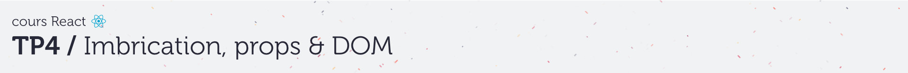
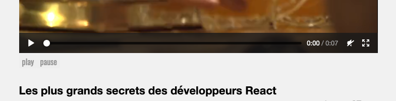

# C. React & l'API DOM <!-- omit in toc -->

## Sommaire <!-- omit in toc -->
- [C.1. Rappels](#c1-rappels)
- [C.2. Mise en oeuvre](#c2-mise-en-oeuvre)

## C.1. Rappels
_**En temps normal, toutes les modifications du DOM doivent passer par le `render()` du composant : l'utilisation de querySelector(), de innerHTML, de setAttribute etc. est INTERDITE.**_

En revanche il existe des modifications de la page qui ne passent pas par un changement de code HTML, et qui donc ne sont pas réalisables via la méthode render :
- la mise du focus sur un champ de saisie
- le dessin dans une balise canvas
- le contrôle de la lecture des balises audio/video
- etc.

Toutes ces opérations se font obligatoirement via des méthodes JS associées aux éléments HTML. Pour pouvoir appeler ces méthodes depuis nos composants React, il faut donc récupérer des **"références"** vers ces éléments HTML (_des "pointeurs" en quelque sorte_).

**C'est là que le concept de ["refs" (_documentation_)](https://fr.reactjs.org/docs/refs-and-the-dom.html#when-to-use-refs) entre en jeu : les refs nous permettent de faire la même chose qu'un `querySelector` (_récupérer une référence vers une balise_) mais de manière compatible avec le Virtual DOM !**

## C.2. Mise en oeuvre
1. **Commencez par ajouter dans le composant `VideoDetail` deux boutons "play" et "pause" juste en dessous de la vidéo**.

	Si vous utilisez le code HTML suivant :
	```html
	<button>play</button>
	<button>pause</button>
	```
	alors vous devriez avoir un rendu qui ressemble à ceci :

	

2. **A l'aide des refs, et des [méthodes JS de la balise `<video>`](https://developer.mozilla.org/fr/docs/Web/API/HTMLMediaElement#M%C3%A9thodes), faites en sorte que la lecture commence ou s'arrête quand l'utilisateur clique sur les 2 boutons "play" et "pause".**

	On pourra ainsi contrôler la vidéo de cette façon :

	


## Étape suivante <!-- omit in toc -->
Une fois cette partie terminée, allons plus loin dans l'utilisation des props et des states en essayant de mettre en place un système de navigation : [D. Navigation maison](D-navigation.md).