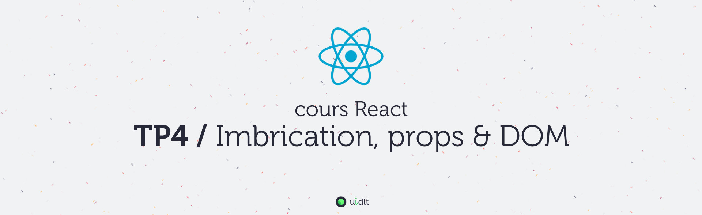

## Objectifs
- Savoir imbriquer des composants
- Utiliser les props
- Utiliser React + l'API DOM

## Sommaire
Pour plus de clarté, les instructions du TP se trouvent dans des fichiers distincts (un fichier par sujet), procédez dans l'ordre sinon, ça fonctionnera beaucoup moins bien !

1. [A. Préparatifs](A-preparatifs.md)
2. [B. Imbrication & props](B-imbrication.md)
4. [C. React & l'API DOM](C-api-dom.md)
5. [D. Navigation maison](D-navigation.md)
